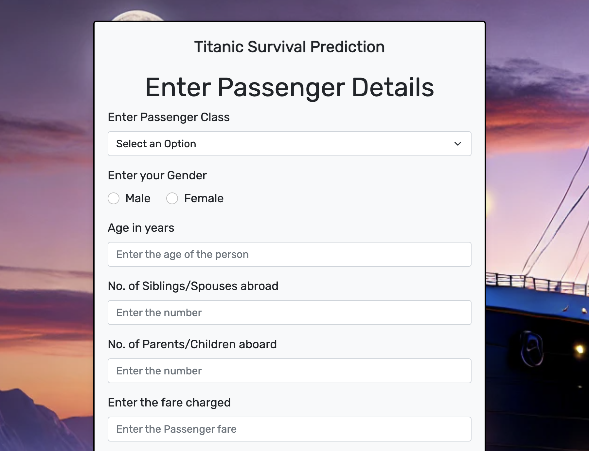
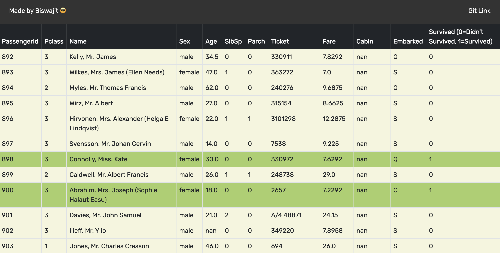

# Titanic Survival Prediction using Decision Tree

This project implements a machine learning model using Decision Tree algorithm to predict passenger survival on the Titanic. The application is built with Flask framework and provides both a web interface for individual predictions and batch processing through file uploads.

## Features

- Individual passenger survival prediction through web form
- Batch prediction through CSV file upload
- Responsive design for mobile and desktop devices
- Interactive web interface with Bootstrap styling
- Clear visualization of prediction results

## Architecture

```
+------------------+     +------------------+     +------------------+
|                  |     |                  |     |                  |
|  Web Interface   | --> |   Flask Server   | --> | Decision Tree    |
|  (HTML/CSS/JS)   |     |   (Python/Flask) |     | Model (sklearn) |
|                  |     |                  |     |                  |
+------------------+     +------------------+     +------------------+
         ↑                       ↓                        ↓
         |                +------------------+    +------------------+
         |                |                  |    |                  |
         +----------------+    Form Data     |    |  Titanic Dataset |
                         |    Processing     |    |  (Training Data) |
                         |                  |    |                  |
                         +------------------+    +------------------+
```

## Technology Stack

- **Frontend**: HTML5, CSS3, Bootstrap 5
- **Backend**: Python, Flask
- **Machine Learning**: scikit-learn (Decision Tree Classifier)
- **Data Processing**: pandas, numpy
- **Version Control**: Git

## Project Structure

```
DecisionTreeOnTitanic/
├── main.py                 # Flask application entry point
├── model/                  # Directory for ML model files
├── static/                 # Static files (CSS, images)
├── templates/              # HTML templates
├── requirements.txt        # Project dependencies
├── titanic-train.csv      # Training dataset
└── Sample File/           # Sample files for testing
```

## Setup and Installation

1. Clone the repository:
   ```bash
   git clone https://github.com/thecuriousjuel/DecisionTreeOnTitanic.git
   ```

2. Create and activate virtual environment:
   ```bash
   python -m venv notebook-venv
   source notebook-venv/bin/activate  # On Windows: notebook-venv\Scripts\activate
   ```

3. Install dependencies:
   ```bash
   pip install -r requirements.txt
   ```

4. Run the application:
   ```bash
   python main.py
   ```

## Usage

1. Individual Prediction:
   - Fill in the passenger details in the web form
   - Click "Predict" to see the survival prediction

2. Batch Prediction:
   - Prepare a CSV file with passenger details
   - Upload the file through the web interface
   - View predictions for all passengers

## Screenshots

### Home Page


### Results Page



## Contributing

Contributions are welcome! Please feel free to submit a Pull Request.

## License

This project is open source and available under the [MIT License](LICENSE).

## Author

- **Biswajit Basak** - [thecuriousjuel](https://github.com/thecuriousjuel)

## Acknowledgments

- Dataset: Titanic Dataset from Kaggle
- Special thanks to all contributors and the open source community
